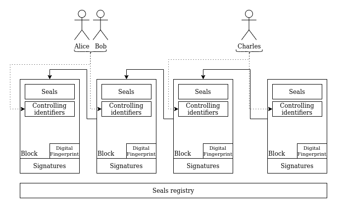

# Microledger spec

Copyrights The Human Colossus Foundation 2021 under the [EUPL 1.2 license](LICENSE)

## Abstract

Although Microledger is not a new term, in this paper we discuss a novel approach to the topic. We propose Microledger, built on top of [Nanoledger](https://github.com/the-human-colossus-foundation/nanoledger-spec), as a self-contained evidence of changes, leveraging the concept of a data provenance log. Provenance logs take a generalized form of a linked list data structure. The log uses cryptographic primitives to ensure integrity and consistency. The log has a strong cryptographic link to its controller.

## Status of This Document

DRAFT

## Introduction

The wish to have parts (or chunks) of data stored in order (or as a chain of events) is not a new phenomenon. For example a _bank account balance_ calculated from all the historical transaction events is definitely a more robust approach than merely changing its balance value. Each time an event (e.g. a money withdrawal) takes place, we'd like to register those events explicitely for future use and verification. By doing so, we can combine two main concepts that have evolved seperately so far: Event Sourcing **[ES]** and _chain of blocks_ or simply a Blockchain. Both structures already exist for quite some time. They solve the same fundamental challenge by providing evidence of state changes. Both share similar characteristics like immutable data structures, append only logs or monotonic updates. These update append anchoring changes always at the end of the log. However, but structures, ES versus blockchains provide those features differenly. The reason for that is their distinct origin: Event Sourcing emerged due the rise of message oriented systems in Service Oriented Architecture **[SOA]** and in particular in Microservices architecture. Conversely, blockchains became mainstream after they where used in bitcoin and other cryptocurrencies. 

The underlying difference between Event Sourcing and Blockchain is how the latter utilizes cryptography to ensure end-verifiability and in particular the authenticity of all the blocks since genesis block. Event Sourcing does not have the characteristic 'end-verifiable'. Blockchains have features beyond end-verfiability. A blockchain is considered a distributed, globally ordered ledger with high resistance to Byzantine generals problem. However, this comes with a cost. Due to the nature how they operate, they are not known for high transaction rates.

In this document we propose __Microledger__ (ML). MLs design blends the concept of Event Sourcing and Blockchain. Microledger is an immutable, append only log that serves end-verifiable evidence of state changes. Microledger does not require global ordering or consistency, or a peer-to-peer network to operate in particular, because it is solely a cryptographically-bound evidence of events. Whoever has a copy of a Microledger instance is able to verify the authenticity on his own and eventally verify the veracity in a next step. Eventually, because it is assumed that controlling identifiers resolution is time consuming operation and may depend on other infrastructure that is not ie. highly available.

Microledgers consist of blocks, which include Seals (see terminology below) that act as abstract data container cordoned off by cryptographic digests. Block also includes Controlling Identifiers, where control authority over the block is defined. Only the sole owner of the block, so the Custodian(s), may anchor new block.
{I think the conception of owner, holder and controller should be explained more at this stage} 
The specification of Controlling Identifiers is optional. In case it's empty, anyone may anchor new block to the chain and external validation strategy needs to be applied if there is a need to verify if the blocked was added according to the business logic in given governance authority.

### Overview
*This section is non-normative.*


Fig: An overview of how blocks are connected. Note it is always a **[DAG]**.


### Benefits
This section is non-normative.

- security layer for authentic data flows
- simple but extensible
- distinction between verfication of attribution (authentication) and verification of accuracy (veracity)

## Terminology

**SAI** Self-Addressing Identifier

**Custodian** a role that indicates the ownership over Microledger.

**Multisig** an ability of the system that requires the Block signing procedure is done by one or more Custodians, so a group. It is a shared commitment of the group to signed Block, which is the outcome of how and from who digital signatures are expected. **[KERI]** 

**Seal** a cryptographic commitment in the form of a cryptographic digest that anchors arbitrary data to Block. **[KERI]**

**Genesis block** first block in the data structure, does not point to previous block.

## Concept

Microledger consists of blocks. Each next block is bound to the previous block by including its cryptographic digest content.


* `Seals` segment _MAY_ include any arbitrary data in a block by including cryptographic digests (provenance) of that data.
* `Controlling identifiers` segment describes control authority over the Microledger in a given block. Control _MAY_ be established for single or multiple identifiers through the multisig feature. Furthermore, control over the Microledger block may be transferred to one or more different identifiers. This is done by anchoring new block to the chain, thus establishing new control authority. `Controlling identifiers` can be anything that is considered identifiable within given network, ie. `Public Key`, `DID`, `KERI` prefix and so on.
* `Time imprint` - segment _MUST_ include an authentic imprint of the digital fingerprint of the block, so that it can be proven that a third party has seen given block in the past. This characteristic attestates that the block existed in the past exactly with given attributes. This form of attestation may have different forms 
* `Digital fingerprint` segment _MUST_ include the cryptographically derived unique fingerprint of a given block. The digital fingerprint is a result of a one-way hash function operation on that block.
* `Signatures` segment _MUST_ include the cryptographic commitment of Custodians to a given Block.
* `Seals registry` and `Seal attachments` provides a mechanism to resolve resources defined within the `seals` segment, The resolution eventually provides them for further operations. `Seals registry` and `Seal attachments` are interchangeable and may be defined per separate Block. `Seal attachments` are content bound to given block and `Seals registry` is an additional layer that specifies how to resolve seals required in specific situations, for example from an external data source or {here another example?}.

### Seals in the form of digests

Microledger does not provide an interface to include arbitrary data into its blocks. Instead ML relies on cryptographic digests (provenance) of this data to ensure:
* maximum adoptability as various use cases will require different data semantics. It is out of Microledger's scope to handle such semantics and it's the consumer's responsibility to address this accordingly;
* easy transferability among the custodians of the Microledger. A cryptographic hash function has a fixed size output for any size given input. Hence, enforcing digests in the `Seals` segment fosters better control of the size of Microledger and substantial reduction of the size of the log. Mind you, this design introduces the need to store and manage the linked sources (input of the hash functions) without defects.
* privacy concerns, be aware that any Microledger can be considered _pii_, personal identifiable information, although it's public and it does not contain any private data at face value.

### Microledger identifier

The unique identifier _MAY_ be derived from the genesis block of the Microledger. In essence this is the cryptographic hash declared for `Genesis Block`.

## Characteristics

### End verifiability

Blocks are chained cryptographically. Each block encapsulates its own `digital fingerprint` and furthermore each next block includes the `digital fingerprint` of the previous block.

### Composability

Microledgers are composable, which means that any newly bootstrapped genesis block can be bound to another Microledger instance.


### Ownership Transferability

A current custodian (or a set of custodians for multisig) _MAY_ transfer the ownership of Microledger to one or more next custodians.

During the course of its lifetime a Microledger does not have an owner at all times. Ownership, under the form of Custodians, is optional and defined per block, in the `Controlling Identifiers` section. So by design Ownership is block scoped and control authority is limited to a given block. 
Knowing that a set of Custodians may anchor several consequtive blocks, it may be tempting to see them as owners of a Microledger, especially if these blocks are the only blocks in the chain. From the Microledger perspective, however, it is seen as a temporary state, because current set of Custodians may always be transferred to a new set of custodians.



As Microledger fosters DAG characteristics, in particular Custodians control authority over given blocks is irrevocable, however they _MAY_ anchor new blocks apart from the main chain. 

The diagram below illustrates this feature:


### Serialization and Encoding 

Microledger uses a self-describing mechanism for encoding and serialization of blocks. 
Serialization and encoding is all about how to package and transmit the blocks over variouse protocols and data formats. A plugable and self-describing mechanism enables algorithmic agility. {what do you want to say here?}

### Plugable 

Each of the core component of the microledger can be combined and adjusted in specific implementations. This enables customization for specific use cases. 


#### Time imprint interface

Provides interfaces to interact with third party services or infrastructure, including:

##### TSA

Timestamp Authorities (TSA) applying RFC 3161.

###### Attestations

TSA service by issuing the block digital fingerprint attestates (in the form of digital certificate), that the block fingerprint has been seen at given point in time in the past.

###### Verification

Perform verification against TSA certificate anchored to the block. In order to do so, obtain a public key (ie. from **[CT]**) of given TSA is enough to conduct the cryptographic verification, so to verify the authenticity. Veracity verification requires from the TSA that it is considered trusted. The trust may be obtained from a **[PKI]** infrastructure, which is publicly considered as trusted, but only if given TSA claims to have a certificate from such PKI.

##### Blockchain

Blockchain clients allowing to anchor transactions.

###### Attestations

By adding the block digital fingerprint into the transaction, which is further anchored into the blockchain block. It is then considered as seen in the past under the form of block transaction. Note the attestation anchored into block transaction is solely dependent upon the block and not the clock. Block is the blockchain clock.

###### Verification
Query given blockchain against transaction specified in the block.

##### KERI

KERI ambient infrastructure based on Witnesses.

###### Attestations

By publishing to Witnesses block digital fingerprints. Witnesses witness under the form of receipts (concept similar to TSA digital certificates) that they have seen given data some time in the past.

###### Verification
Querying Witnesses or Watchers against given data to get the receipt. Receipts provide cryptographic proof and so can be verified against Witness public key. Note KERI is an ambient infrastructure, hence the amount of Witnesses required to consider given receipt as authentic may vary and is up to publisher how many Witnesses is required to satisfy the "enough Witnesses" requirement.


## Block fundamentals explained

### Seals

A seal is a qualified digest where its derivation code specifies what type of hashing function was used. However, a seal does not include any other information about the associated data. The hashing step produces a digest of the serialized data that is referenced by the seal. The seal acts as an anchor of the data. To clarify, the actual data is not provided explicitly in the seal, but merely the digest of the serialized data, hence the data is hidden. This may be useful in making verifiable cryptographic commitments at the location of an event to data stored and/or disclosed elsewhere.

### Digital fingerprint

A digital fingerprint (hash) is produced by a type of one-way function. Given that the hashing function has sufficiently strong collision resistance then it uniquely securely cryptographically binds its output digest to the contents of the block.

### Seals Attachment 

Seals Attachment is the mechanism to attach content represented by the `Seal` to the encoded block. This allows to have simple and very portable (without any lookups) resultion mechanism of the content which is the subject of the block.

### Seals Registry

Seals registry it is a external component to the microledger which acts as a lookup mechanism for content resolution based on the seal. This specification does not have an opinion what and how this resolution mechanism could work. There are meny variantions and depending on the needs it could be realize in different ways. The most important is the assurance about the security of the bound content to the seal. This follows the characteristics of content-centric networks where we care what it is but not where it is.

### Mapping table codes

**NOTE:** This is just an example not yet definitive 

The tables below provide the registry of derivation codes for all supported components.

Digital fingerprint representation:

|Concept|Code|
|---|---|
|SAI|A|
|Multihash|B|

Seal representation:

|Concept|Code|
|---|---|
|SAI|A|
|Multihash|B|

Control identifiers representation:

|Concept|Code|
|---|---|
|Self-certifying basic prefix|A|
|Self-certifying self-addressing prefix|B|
|Self-certifying self-signing prefix|C|
|DID:peer|D|
|DID:web|E|

## Extended Characteristics

### End verifiability

It's a two step process, where both authenticity and integrity are being verified.

#### Authenticity

It goes block by block, starting from genesis block. The verification consists of the folowing steps:
* cryptographically verify that `digital fingerprint` matches given block and for blocks, where block number `N > 1` include `digital fingerprint` of the previous block;
* cryptographically verify that genesis block signatures match Custodian(s) public keys specified within `Controlling identifiers`;
* cryptographically verify signatures of block, where block number `N > 1` match the  `Controlling identifiers`, so the Custodian(s) public keys of block number `N`.

The Custodian(s) public keys are derived from their identifiers.


Fig: Scopes of verifiability are shown within dashed lines. `Controlling identifiers` public keys of `N-th` block have to match signatures of `N-th + 1` block.

The genesis block (first block) is verfieid with the `controlling identifiers` of same block.

##### Empty controlling identifiers

If controlling identifiers are empty, the authenticity can still be achieved by external logic which could be incorporated into the payload (seal) of the block. The risk with leaving out the `controlling identifiers` is that you as custodian you would always be dependent on external service for validation and could not have control over microledger. This approach could conflict with the overall zero trust architecture if done wrongly. Although not recommended it is still completely valid use cases to have it empty the custodian need to take into consideration in that situation the security risks depending on how the validation strategy would be applied.
On other hand, it gives more flexibility where you don't need to know upfront about who could be the controlling identifier and add some more complex validation strategies other than simple keys commitment. 


#### Veracity

To establish a trust basis under a Microledger instance, further verification is required, so whether all Custodians reputation is considered trusted. This is conducted by verifying all Custodians identifiers, generally using a third party Governance Framework. 

### Ownership Transferability

To transfer the ownership of given Microledger instance, the current owners need to create new block with new set of the controlling keys in `Controling identifiers`

#### Transfer between custodians

Microledger expects at least one custodian to be assigned under `Controlling identifiers`. Transfering the whole Microledger instance (and not only the ownership) is not bound to any specific protocol and might vary per usecase.

Transferring a Microledger instance requires a sender and a receiver.

For a Microledger instance to be considered as 'transferred' to other custiodians require both:
1. the chain of blocks 
2. and seals registry
 to be transferred. 

The transfer process is:
* synchronous, when it is assumed that seals are not significant in size, yet essential attribution to the chain;
* asynchronous in scenarios where seals transfer requires significant time to be completed.

The latter eventually aim to preserve consistenty. This process is also more flexible, because the receiver is able to immediately verify the authenticity of the chain without having to wait for the seals to arrive.

It is allowed to have a Microledger instance, where the seals registry does not contain any physical data, but only provides an interface to this data, e.g. `IPFS` or `BitTorrent` networks.

It is up to the user to decide, which approach is best.

### Serialization and transport 

Synchronous and asynchronous transfer enforces appropriate exchange protocols to be used in given scenario. A synchronous transfer consist of a bundle or an envelope, which contains both the chain of blocks and the seals registry. 

## References

* **[KERI]**: https://github.com/SmithSamuelM/Papers/blob/master/whitepapers/KERI_WP_2.x.web.pdf
* **[ACDC]**: https://github.com/SmithSamuelM/Papers/blob/master/whitepapers/ACDC.web.pdf
* **[CESR]**: https://github.com/decentralized-identity/keri/blob/master/kids/kid0001.md
* **[DAG]**: https://en.wikipedia.org/wiki/Directed_acyclic_graph
* **[ES]**: https://martinfowler.com/eaaDev/EventSourcing.html
* **[SOA]**: https://en.wikipedia.org/wiki/Service-oriented_architecture
* **[CT]**: https://en.wikipedia.org/wiki/Certificate_Transparency
* **[PKI]**: https://en.wikipedia.org/wiki/Public_key_infrastructure
* [Multiformats] <https://multiformats.io/>
* [Multicodec] <https://github.com/multiformats/multicodec>
* [Multihash] <https://multiformats.io/multihash/>
* [CESR] Smith, S., "KID0001 - Prefixes, Derivation and derivation reference tables", <https://github.com/decentralized-identity/keri/blob/master/kids/kid0001.md>
* [CESRCommentary] Smith, S., "KID0001 - Commentary - Prefixes, Derivation and derivation reference tables", <https://github.com/decentralized-identity/keri/blob/master/kids/kid0001Comment.md>
* [CDE] Huesby, D., "Cryptographic Data Encoding (CDE)", <https://hackmd.io/@dhuseby/BkG-4gp2u>
* [JOSE] JOSE Workgroup Documents, <https://datatracker.ietf.org/wg/jose/documents/>
* [COSE] COSE Workgroup Documents <https://datatracker.ietf.org/wg/cose/documents/>

## Appendix: examples

```
{

}
```
