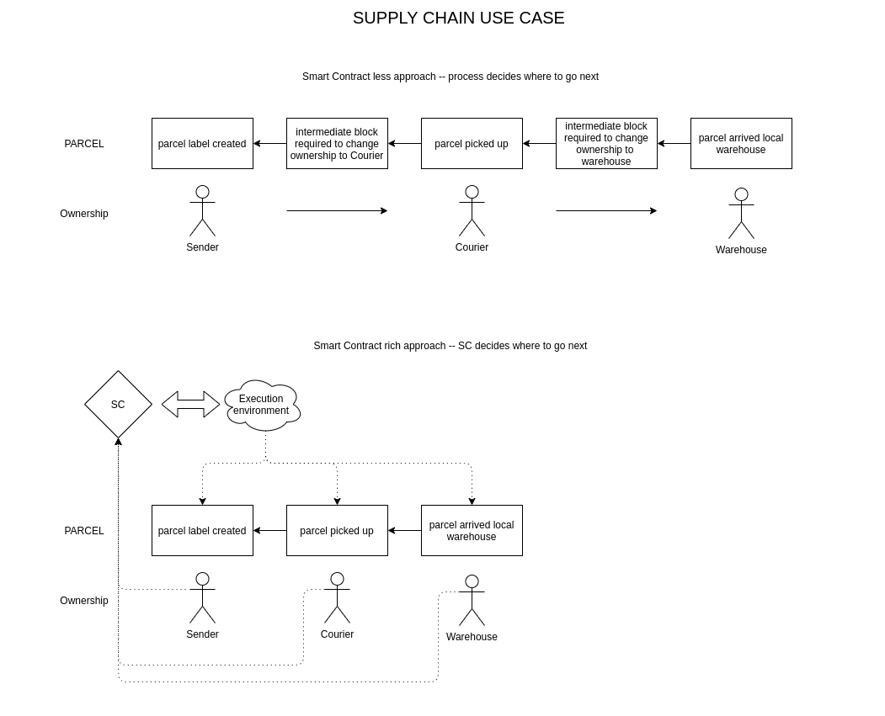

# Microledger use cases 

## Digital identifier 

Key event logs introduced by [KERI](https://keri.one) offer huge improvements over any digital identifier based on decentralized key management solutions. Microledger is a generalize data model of such a key provenance log. With slight adjustments of the implementation of Keri, we can come up with a fully compatible mechanism {to what?}. The rules are relatively simple in KERI:
- linear chain
- clear definition who is able to add next block / event
- clear definition what is allowed ROT, IXP and ICR events
{Explain these abbreviations: ROT, IXP and ICR}

## GIT

Introducing the Microledger concept to a versioning system like git, brings digest agility and encryption agility dependent of what is neccessary: 
- authenticity provenance
- decentralized mechanisms of managing git repository, licensing, and policies 
- managing Intellectual Property Rights (IPR).

## Authentic Data Chain Containers

[ACDC](https://github.com/trustoverip/TSS0033-technology-stack-acdc/blob/main/docs/index.md) was a huge inspiration for Microledger. `ACDC` is the closest development of what we'd like to achieve. Having a generalized structure of cryptographically linked data brought us to create based rules how data, identifiers, semantic and rules can be set together to manage any arbitrary data in secure and authentic way. Whether one should implement either `ACDC` or the Microledger data model is determined by the details of a project.

## Supply chain

